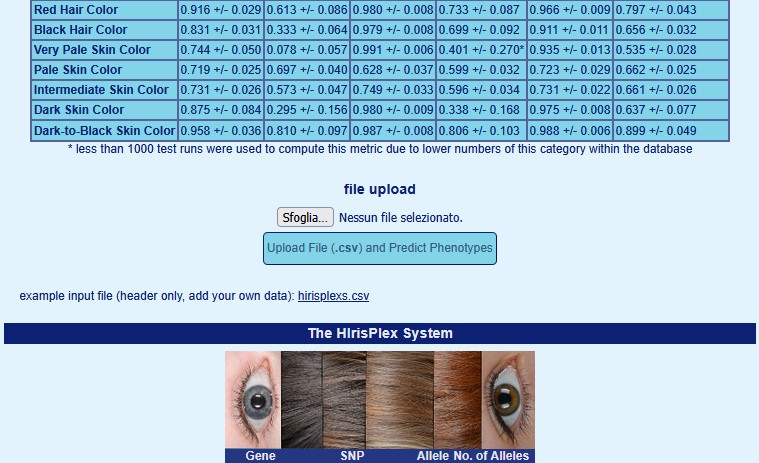

Phenotype reconstruction using GLIMPSE2 imputation and aHISplex
======================================================
This is a tutorial to predict the visible traits (hair, eye and skin colors) in humans from ancient/low coverage shotgun WGS DNA. The approach is described detail in two manuscripts:

>Simone Rubinacci, Robin J. Hofmeister, Bárbara Sousa da Mota & Olivier Delaneau: **Imputation of low-coverage sequencing data from 150,119 UK Biobank genomes.**
>
>doi: [https://doi.org/10.1038/s41588-023-01438-3](https://doi.org/10.1038/s41588-023-01438-3)

<br>

>Zoltán Maróti, Emil Nyerki, Tibor Török, Gergely István Varga, Tibor Kalmár: **Robust imputation-based method for eye, hair, and skin colour prediction from low-coverage ancient DNA**
>
>doi: [https://doi.org/10.1038/s41598-026-38372-3](https://doi.org/10.1038/s41598-026-38372-3)

### GLIMPSE2 imputation
Please follow the guide at: (preferably static binaries)
> [https://odelaneau.github.io/GLIMPSE/](https://odelaneau.github.io/GLIMPSE/)
Then follow the tutorial "Imputation using 1000GP reference panel"

### aHISplex phenotyping
The official guide is [here](https://github.com/zmaroti/aHISplex), but it is currently outdated. 
To install and build, we can use a conda environment and then :
```sh
conda create -n aHISplex_env -c conda-forge -c bioconda go bcftools make
conda activate aHISplex_env
cd your_chosen_dir
git clone https://github.com/zmaroti/aHISplex.git
cd aHISplex
make
cd ..
git clone https://github.com/G-Villani/Phenotyping-ancient-individuals.git
cd Phenotyping-ancient-individuals
```
Then, there are two ways to proceed:

**Option A – Starting from raw/low-coverage BAM files (full pipeline):**
Follow the [aHISplex quickstart](https://github.com/zmaroti/aHISplex) which includes GLIMPSE2 imputation (very fast)(you need to install GLIMPSE2). Then go to [Step 2](#step-2--upload-merge-and-classify) .

**Option B – Starting from already imputed data (BCF/VCF):**
Use the modified script below (Note: 1 of the 41 variants, rs312262906, extremely rare (global MAF = 0.00078), is set at 0 in this case). See [Step 1](#step-1--extract-hirisplex-s-variants) .

## Step 1 – Extract HIrisPlex-S variants
Assuming we have already imputed data, we use the modified script 1_aHISplex_noImputation.sh:
> [!WARNING]
> The imputation software used is not important, but the input must be phased, split by chromosome (chr1–chr22), and in VCF or BCF format.

```sh
sbatch scripts/1_aHISplex_noImputation.sh   --in-dir   path/to/your/bcf_or_vcf_s           \
                                            --prefix   common_input_name_before_CHR        \
                                            --suffix   common_input_name_after_CHR         \
                                            --a-dir    path/to/your/aHISplex_installed_dir \
                                            --out-dir  path/to/your/output_dir             \
                                            --ref GRCh37
## Manual page if you do: bash scripts/1_aHISplex_noImputation.sh --help
```

## Step 2 – Upload, merge and classify
Upload the output (HISplex41_upload.csv) [here](https://hirisplex.erasmusmc.nl/). Download/save the resulting phenotype probability output file.
>
>
Then we merge input and output:
```sh
conda activate any_env_with_R ##but better if dplyr already present
Rscript scripts/2_merge_hisplex.R HISplex41_upload.csv Result.csv Complete_info.csv 
```
Complete information is necessary (90 columns) for classifHISplex to work (not explained well in their github).
We can finally obtain phenotypes of our individuals:
```sh
aHIS_dir=path/to/your/aHISplex_installed_dir 
conda activate aHISplex_env
${aHIS_dir}/bin/./classifHISplex -short Complete_info.csv > classifications_short.csv
##or
${aHIS_dir}/bin/./classifHISplex Complete_info.csv > classifications_long.csv
```
Please look also at [Official Manual](https://hirisplex.erasmusmc.nl/pdf/hirisplex.erasmusmc.nl.pdf) if hair colour red or black is not chosen but p_value greater than 0.25 . 
